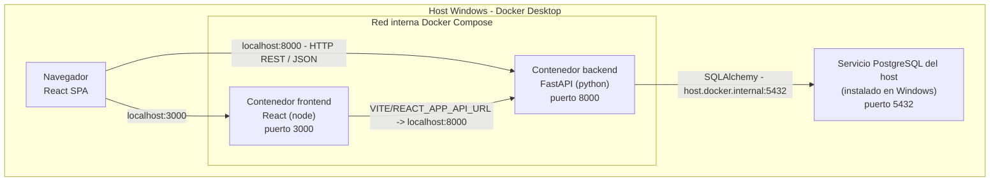
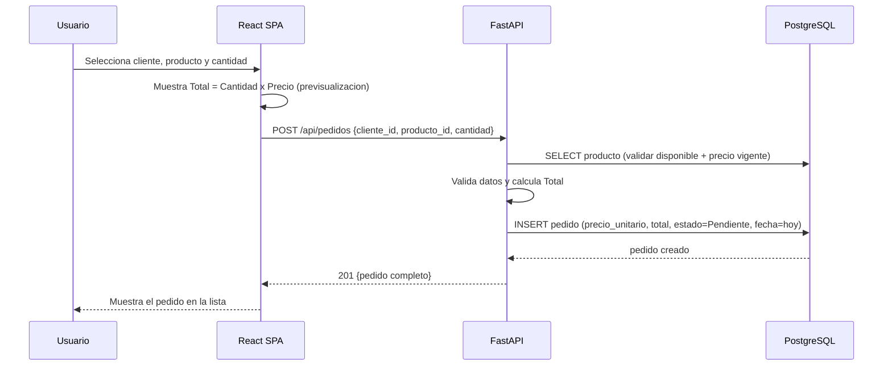
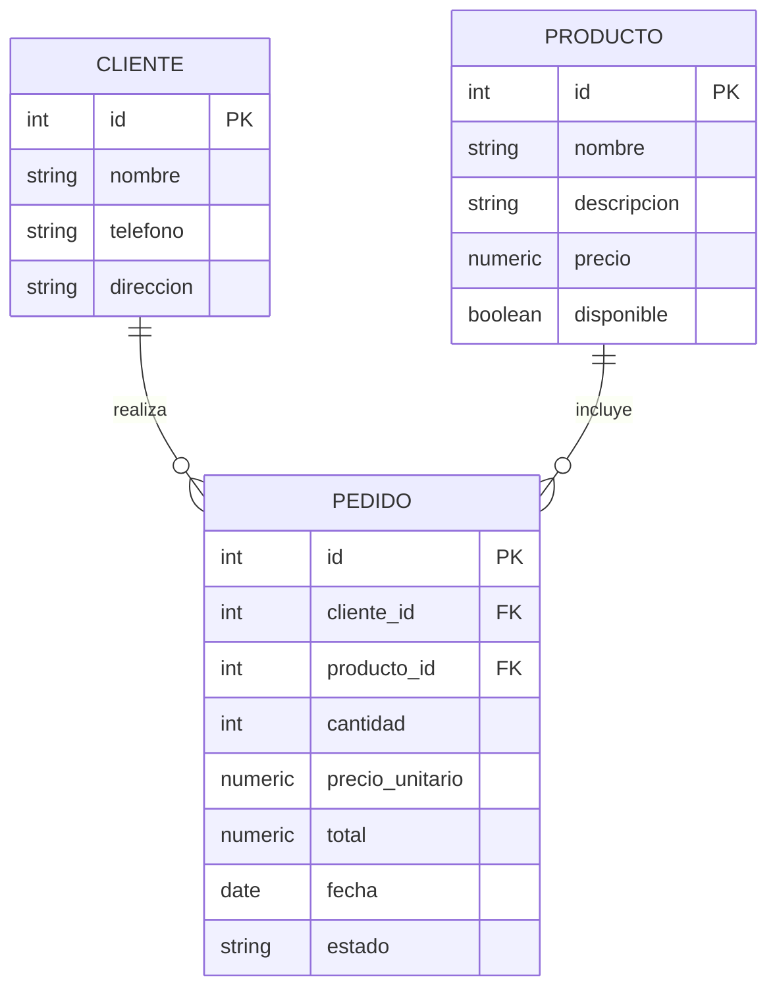
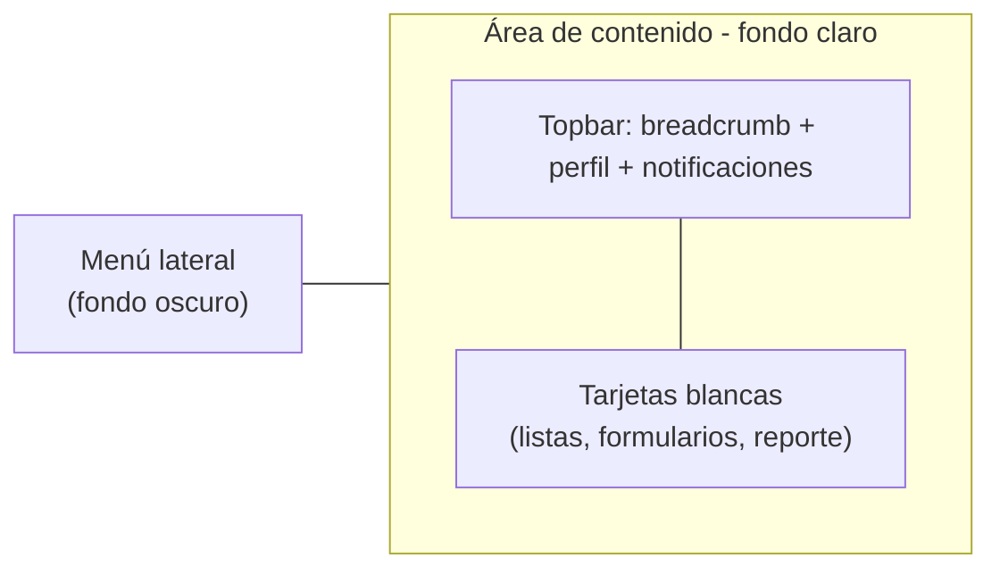

# Design Document

## Overview

**Control de Pedidos** es una aplicación web pequeña y educativa para un negocio de comida. Su objetivo es reemplazar el registro manual de pedidos (hoy hecho a partir de mensajes de WhatsApp) por un sistema centralizado que administra Clientes, Productos y Pedidos, calcula automáticamente los totales y muestra un reporte diario de ventas.

El diseño sigue una arquitectura clásica de tres capas, deliberadamente simple para facilitar su implementación local en Windows:

- **Frontend (React):** una Single Page Application (SPA) con un menú lateral que navega entre las secciones Inicio, Clientes, Productos, Pedidos y Reporte diario.
- **Backend (FastAPI + Python):** una API REST que expone las operaciones sobre Clientes, Productos y Pedidos, aplica las reglas de negocio (validaciones, cálculo del total, precio unitario vigente, reporte diario) y responde siempre en JSON.
- **Base de datos (PostgreSQL):** persiste Clientes, Productos y Pedidos en tres tablas relacionadas.

**Ejecución con Docker en Windows:** la aplicación se ejecuta localmente mediante **Docker Desktop en Windows**. Solo el **frontend** y el **backend** corren como contenedores, orquestados con **Docker Compose**. La **base de datos PostgreSQL NO corre en Docker**: es un servicio ya instalado y en ejecución de forma persistente directamente en el host de Windows. El backend, desde su contenedor, se conecta a esa PostgreSQL del host usando el nombre especial `host.docker.internal:5432`, que en Docker Desktop para Windows resuelve a la máquina anfitriona. A diferencia de una versión anterior de este diseño (que empaquetaba PostgreSQL en un contenedor con su propio volumen), aquí el estudiante SÍ necesita tener PostgreSQL instalado y corriendo en Windows, además de Docker Desktop. Con eso listo, levanta el frontend y el backend con un solo comando (`docker compose up`) sin instalar manualmente Node ni Python en el host. Los puertos de los contenedores se publican hacia el host de Windows para poder acceder desde el navegador.

Principios de diseño para este proyecto:

- **Simplicidad primero:** sin autenticación, sin roles, sin capas de abstracción innecesarias. El objetivo es que un estudiante pueda entender y ejecutar el proyecto completo.
- **Reglas de negocio en el backend:** las validaciones y cálculos críticos (total, precio vigente, estados válidos, exclusión de productos no disponibles, exclusión de cancelados en el reporte) viven en el backend para garantizar consistencia. El frontend replica algunas validaciones solo para mejorar la experiencia (por ejemplo, mostrar el total antes de guardar).
- **Contratos JSON claros:** cada endpoint tiene un contrato explícito de request/response para que el flujo de datos sea fácil de seguir.

Este documento cubre los Requerimientos 1 a 16 de `requirements.md`.

## Architecture

La aplicación usa tres capas que se comunican de forma unidireccional: el navegador ejecuta la SPA de React, que consume la API REST de FastAPI mediante HTTP/JSON, y FastAPI persiste los datos en PostgreSQL mediante un ORM (SQLAlchemy). El frontend y el backend se empaquetan cada uno en su propio contenedor Docker y se orquestan con Docker Compose sobre Docker Desktop en Windows. La base de datos PostgreSQL, en cambio, es un servicio del host de Windows y queda fuera de la red de Docker Compose.

El navegador del usuario corre en el host de Windows y accede a los contenedores a través de los puertos publicados. El backend, desde su contenedor, alcanza la PostgreSQL del host mediante el nombre especial `host.docker.internal:5432` en lugar de `localhost`, porque dentro de un contenedor `localhost` se refiere al propio contenedor.



Notas del diagrama:

- El host de Windows publica los puertos `3000` (frontend) y `8000` (backend) de los contenedores. La PostgreSQL del host escucha en su puerto `5432` de Windows, pero no forma parte de la red de Docker Compose.
- El frontend obtiene la URL del backend desde una variable de entorno (por ejemplo `VITE_API_URL` o `REACT_APP_API_URL`) que apunta al puerto publicado del backend en el host.
- El backend se conecta a la base de datos mediante `host.docker.internal:5432`, que en Docker Desktop para Windows resuelve al host anfitrión donde vive el servicio PostgreSQL.
- No existe un volumen de Docker para PostgreSQL: la persistencia de los datos (clientes, productos, pedidos) la maneja el propio servicio PostgreSQL instalado en Windows.

### Flujo de una petición típica (crear pedido)



### Componentes de la arquitectura

- **React SPA:** navegación por estado en el cliente (una sola página, sin recarga). Cada sección es un componente que consume la API mediante un cliente HTTP centralizado.
- **API FastAPI:** organizada en routers por recurso (`clientes`, `productos`, `pedidos`, `reporte`). Usa modelos Pydantic para validación de entrada/salida y una capa de servicios con las reglas de negocio puras (cálculo de total, agregación del reporte, validación de estado).
- **PostgreSQL (servicio del host Windows):** tres tablas con claves foráneas de `pedido` hacia `cliente` y `producto`. Corre como servicio persistente instalado en Windows, no en un contenedor.

### Estructura de carpetas propuesta

```
Proyecto_P4_PEDIDOS/
├── docker-compose.yml       # Orquesta solo los servicios frontend y backend (PostgreSQL vive en el host)
├── .env                     # Variables de entorno (credenciales y URLs) - no versionar
├── backend/
│   ├── Dockerfile           # Imagen del backend (base python)
│   ├── .dockerignore        # Excluye venv, __pycache__, tests, etc.
│   ├── requirements.txt     # Dependencias Python (fastapi, uvicorn, sqlalchemy, psycopg, hypothesis)
│   ├── main.py              # Instancia FastAPI + CORS + inclusion de routers
│   ├── database.py          # Conexion SQLAlchemy a PostgreSQL (lee DATABASE_URL del entorno)
│   ├── models.py            # Modelos ORM (Cliente, Producto, Pedido)
│   ├── schemas.py           # Modelos Pydantic (request/response)
│   ├── services.py          # Reglas de negocio puras (total, estado, reporte)
│   ├── routers/
│   │   ├── clientes.py
│   │   ├── productos.py
│   │   ├── pedidos.py
│   │   └── reporte.py
│   └── tests/
│       ├── test_properties.py   # Pruebas basadas en propiedades (Hypothesis)
│       └── test_examples.py     # Pruebas por ejemplo / casos de borde
└── frontend/
    ├── Dockerfile           # Imagen del frontend (base node)
    ├── .dockerignore        # Excluye node_modules, build, etc.
    └── src/
        ├── App.jsx              # Layout + menu lateral + enrutado por estado
        ├── api.js               # Cliente HTTP centralizado (lee la URL del backend del entorno)
        └── secciones/
            ├── Inicio.jsx
            ├── Clientes.jsx
            ├── Productos.jsx
            ├── Pedidos.jsx
            └── ReporteDiario.jsx
```

**Variables de entorno (`.env`):** el archivo `.env` en la raíz centraliza la configuración que consume `docker-compose.yml`, evitando credenciales incrustadas en el código. La cadena de conexión apunta al servicio PostgreSQL del host de Windows a través de `host.docker.internal:5432`, no a un servicio de Docker llamado `db`. Ejemplo:

```
# Cadena de conexion que usa el backend.
# host.docker.internal:5432 = el servicio PostgreSQL instalado en el host Windows.
# Reemplaza <usuario>, <password> y <basedatos> por los de tu PostgreSQL de Windows.
DATABASE_URL=postgresql+psycopg://<usuario>:<password>@host.docker.internal:5432/<basedatos>

# URL del backend que consume el frontend (puerto publicado en el host)
VITE_API_URL=http://localhost:8000/api
```

El backend lee `DATABASE_URL` en `database.py`; el frontend lee `VITE_API_URL` (o `REACT_APP_API_URL`) en `api.js`. Como PostgreSQL ya no corre en Docker, `.env` no necesita las variables `POSTGRES_USER`, `POSTGRES_PASSWORD` ni `POSTGRES_DB` (esas credenciales se configuran directamente en el servicio PostgreSQL de Windows). En un proyecto educativo, `.env` puede incluir valores por defecto, pero no debe subirse a control de versiones si contiene credenciales reales.

### Estrategia de contenedorización y despliegue local (Docker)

El despliegue local se resuelve con Docker Compose sobre Docker Desktop en Windows. Se mantiene intencionalmente simple para un proyecto educativo: **solo dos servicios** en contenedores (frontend y backend) y una red. La base de datos PostgreSQL vive fuera de Docker, como servicio del host de Windows.

**Servicios definidos en `docker-compose.yml`:**

| Servicio | Imagen base sugerida | Puerto host → contenedor | Rol |
|----------|----------------------|--------------------------|-----|
| `frontend` | `node` (por ejemplo `node:20`) | `3000 → 3000` | Sirve la SPA de React; en desarrollo puede usar el servidor de Vite/React. |
| `backend` | `python` (por ejemplo `python:3.12-slim`) | `8000 → 8000` | Ejecuta FastAPI con Uvicorn; contiene las reglas de negocio y se conecta a la PostgreSQL del host. |

**Conexión del backend a la PostgreSQL del host (`host.docker.internal`).** Como la base de datos no es un contenedor sino un servicio del host de Windows, el backend no puede alcanzarla por un nombre de servicio de Compose ni por `localhost` (dentro de un contenedor, `localhost` apunta al propio contenedor). En su lugar usa el nombre especial `host.docker.internal`, que Docker Desktop para Windows resuelve automáticamente a la dirección del host anfitrión. Así la cadena de conexión del backend es `postgresql+psycopg://...@host.docker.internal:5432/...`, y la petición sale del contenedor hacia el puerto `5432` de Windows donde escucha PostgreSQL. `host.docker.internal` es, en resumen, el "puente" que Docker Desktop ofrece para que un contenedor alcance servicios que corren directamente en la máquina anfitriona.

**Persistencia de datos.** No hay volumen de Docker para PostgreSQL, porque PostgreSQL no corre en un contenedor. La persistencia de los datos (clientes, productos, pedidos) la provee el servicio PostgreSQL instalado en Windows, que ya existe y gestiona su propio almacenamiento. Detener los contenedores (`docker compose down`) no afecta a la base de datos del host.

**Comunicación frontend → backend.** El frontend corre en el navegador del host, no dentro de la red de Compose, por lo que no puede usar el nombre de servicio `backend`. En su lugar consume el backend a través del puerto publicado en el host (`http://localhost:8000/api`), tomado de la variable de entorno `VITE_API_URL` (o `REACT_APP_API_URL`). El backend debe habilitar CORS para el origen del frontend (`http://localhost:3000`).

**Dependencias de arranque.** El servicio `backend` ya no declara `depends_on: db`, porque no hay servicio `db` en Compose. Como la base de datos es externa, conviene que el backend reintente la conexión al inicio para tolerar que PostgreSQL tarde unos segundos en aceptar conexiones tras un arranque de Windows.

**Ejemplo resumido de `docker-compose.yml`:**

```yaml
services:
  backend:
    build: ./backend
    environment:
      DATABASE_URL: ${DATABASE_URL}
    ports:
      - "8000:8000"
    # En Docker Desktop para Windows, host.docker.internal ya esta disponible
    # por defecto. Si en algun entorno no resolviera, puede agregarse:
    # extra_hosts:
    #   - "host.docker.internal:host-gateway"

  frontend:
    build: ./frontend
    environment:
      VITE_API_URL: ${VITE_API_URL}
    ports:
      - "3000:3000"
    depends_on:
      - backend
```

No se define ninguna sección `volumes` (la persistencia la maneja el PostgreSQL del host) ni un servicio `db`.

**Cómo levantar todo.** Desde la raíz del proyecto en Windows (PowerShell o la terminal integrada), con Docker Desktop en ejecución y el servicio PostgreSQL de Windows ya corriendo:

```powershell
docker compose up --build
```

Esto construye las imágenes del frontend y backend y arranca ambos contenedores. El backend se conecta a la PostgreSQL del host vía `host.docker.internal:5432`. Luego el sistema queda disponible en `http://localhost:3000` (frontend) y `http://localhost:8000` (API). Para detener y liberar recursos: `docker compose down` (esto no borra datos, porque la base vive en el host).

**Requisitos previos.** Es necesario tener:

- **Docker Desktop instalado y en ejecución en Windows** (con el backend WSL 2 recomendado), para el frontend y el backend.
- **Un servicio PostgreSQL instalado y corriendo en Windows**, con una base de datos creada y sus credenciales configuradas en `DATABASE_URL` dentro de `.env`.

No se requiere instalar Node ni Python directamente en el host; esos viven dentro de los contenedores.

## Components and Interfaces

### Componentes del frontend (React)

| Componente | Responsabilidad | Requerimientos |
|------------|-----------------|----------------|
| `App` | Layout general, renderiza `MenuLateral` y la sección activa; mantiene en estado la sección seleccionada. Al iniciar muestra `Inicio`. | 1, 13 |
| `MenuLateral` | Muestra las opciones Inicio, Clientes, Productos, Pedidos y Reporte diario; resalta la sección activa; notifica el cambio de sección. | 1 |
| `Inicio` | Vista general con accesos directos a Clientes, Productos, Pedidos y Reporte diario. | 13 |
| `Clientes` | Lista clientes, formulario de alta y edición; muestra mensaje si no hay clientes; muestra errores de validación conservando lo ingresado. | 2, 3, 4 |
| `Productos` | Lista productos, formulario de alta y edición (incluye Disponible); muestra mensaje si no hay productos; muestra errores. | 5, 6, 7 |
| `Pedidos` | Formulario de creación (selección de cliente, de producto solo disponibles, cantidad); previsualización del Total; lista de pedidos; control para cambiar el estado. | 8, 9, 10, 11 |
| `ReporteDiario` | Selector de día (por defecto hoy); muestra pedidos del día, conteo total y suma de ventas (excluye cancelados); mensaje si no hay pedidos. | 12 |
| `api` (módulo) | Cliente HTTP centralizado; interpreta respuestas y errores; genera el mensaje de "no fue posible conectar con el servidor". | 15, 16 |

Notas de comportamiento del frontend:

- En `Pedidos`, el desplegable de productos solo lista los que tienen `disponible = true` (Req. 7.3, 8.8). La previsualización del Total se recalcula al cambiar la cantidad (Req. 9.2, 9.3).
- Ante un error del backend, los formularios conservan los datos ingresados (Req. 2.5, 5.2–5.4, 8.5–8.8, 16.1).
- La apariencia visual de estos componentes (menú lateral, formularios, tarjetas, tablas) se detalla en la sección **Visual Style**. Esa sección solo define estilo y no altera el comportamiento funcional descrito aquí.

### Routers y endpoints del backend (FastAPI)

Prefijo común: `/api`. Todas las respuestas son JSON.

**Router `clientes`** (Req. 2, 3, 4)

| Método | Ruta | Descripción |
|--------|------|-------------|
| `GET` | `/api/clientes` | Lista todos los clientes. |
| `POST` | `/api/clientes` | Crea un cliente. |
| `GET` | `/api/clientes/{id}` | Obtiene un cliente. |
| `PUT` | `/api/clientes/{id}` | Actualiza un cliente. |

**Router `productos`** (Req. 5, 6, 7)

| Método | Ruta | Descripción |
|--------|------|-------------|
| `GET` | `/api/productos` | Lista productos. Acepta `?solo_disponibles=true` para el selector de pedidos. |
| `POST` | `/api/productos` | Crea un producto (Disponible por defecto `true`). |
| `GET` | `/api/productos/{id}` | Obtiene un producto. |
| `PUT` | `/api/productos/{id}` | Actualiza un producto. |

**Router `pedidos`** (Req. 8, 9, 10, 11)

| Método | Ruta | Descripción |
|--------|------|-------------|
| `GET` | `/api/pedidos` | Lista pedidos con datos de cliente y producto. |
| `POST` | `/api/pedidos` | Crea un pedido: toma el precio vigente del producto, calcula el total, asigna fecha de hoy y estado `Pendiente`. |
| `PATCH` | `/api/pedidos/{id}/estado` | Cambia el estado del pedido (validando los 4 valores). |

**Router `reporte`** (Req. 12)

| Método | Ruta | Descripción |
|--------|------|-------------|
| `GET` | `/api/reporte-diario?fecha=YYYY-MM-DD` | Devuelve pedidos del día, conteo total y suma de ventas (excluye cancelados). Si se omite `fecha`, usa el día actual. |

### Capa de servicios (reglas de negocio puras)

Estas funciones son puras (sin acceso a base de datos) para poder probarlas fácilmente, incluyendo pruebas basadas en propiedades:

- `calcular_total(cantidad: int, precio_unitario: Decimal) -> Decimal` — Total = cantidad × precio_unitario (Req. 9.1).
- `es_estado_valido(estado: str) -> bool` — verifica que el estado sea uno de los 4 valores (Req. 10.3).
- `resumir_reporte(pedidos: list[Pedido]) -> ResumenReporte` — calcula conteo total y suma de ventas excluyendo cancelados (Req. 12.4, 12.5).
- `producto_seleccionable(producto: Producto) -> bool` — indica si el producto puede incluirse en un pedido (Req. 7.3, 8.8).

## Data Models

### Diagrama entidad-relación



### Tabla `cliente` (Req. 2, 3, 4)

| Columna | Tipo | Restricciones | Notas |
|---------|------|---------------|-------|
| `id` | `SERIAL` / `INTEGER` | PK | Autoincremental. |
| `nombre` | `VARCHAR(100)` | `NOT NULL` | 1 a 100 caracteres, no solo espacios. |
| `telefono` | `VARCHAR(20)` | `NOT NULL` | 1 a 20 caracteres, no solo espacios. |
| `direccion` | `VARCHAR(200)` | NULL permitido | Opcional, hasta 200 caracteres. |

### Tabla `producto` (Req. 5, 6, 7)

| Columna | Tipo | Restricciones | Notas |
|---------|------|---------------|-------|
| `id` | `SERIAL` / `INTEGER` | PK | Autoincremental. |
| `nombre` | `VARCHAR(100)` | `NOT NULL` | 1 a 100 caracteres. |
| `descripcion` | `VARCHAR(500)` | NULL permitido | Hasta 500 caracteres. |
| `precio` | `NUMERIC(8,2)` | `NOT NULL`, `CHECK (precio >= 0 AND precio <= 999999.99)` | 0.00 a 999999.99, 2 decimales. |
| `disponible` | `BOOLEAN` | `NOT NULL DEFAULT TRUE` | Por defecto verdadero (Req. 5.5). |

### Tabla `pedido` (Req. 8, 9, 10, 11)

| Columna | Tipo | Restricciones | Notas |
|---------|------|---------------|-------|
| `id` | `SERIAL` / `INTEGER` | PK | Autoincremental. |
| `cliente_id` | `INTEGER` | `NOT NULL`, FK → `cliente(id)` | Cliente obligatorio (Req. 8.6). |
| `producto_id` | `INTEGER` | `NOT NULL`, FK → `producto(id)` | Producto obligatorio (Req. 8.7). |
| `cantidad` | `INTEGER` | `NOT NULL`, `CHECK (cantidad BETWEEN 1 AND 9999)` | Entero 1 a 9999 (Req. 8.5). |
| `precio_unitario` | `NUMERIC(8,2)` | `NOT NULL` | Precio vigente del producto al crear (Req. 8.4). Copiado, no referenciado, para conservar el histórico. |
| `total` | `NUMERIC(12,2)` | `NOT NULL` | cantidad × precio_unitario (Req. 9.1). |
| `fecha` | `DATE` | `NOT NULL DEFAULT CURRENT_DATE` | Fecha de creación (Req. 8.2). |
| `estado` | `VARCHAR(20)` | `NOT NULL`, `CHECK (estado IN ('Pendiente','Preparando','Entregado','Cancelado'))` | Estado del ciclo de vida (Req. 8.3, 10). |

Decisión de diseño clave: `precio_unitario` se **copia** en el pedido en lugar de leerse del producto al momento de consultar. Esto asegura que cambios posteriores al precio del producto no alteren pedidos ya creados (Req. 8.4).

Los montos usan `NUMERIC` (mapeado a `Decimal` en Python) y no punto flotante, para evitar errores de redondeo en cálculos de dinero.

**Persistencia gestionada externamente.** La base de datos es un servicio PostgreSQL instalado en el host de Windows, no un almacenamiento efímero ni un contenedor. Es persistente y su ciclo de vida es independiente de los contenedores: detener o reconstruir el frontend y el backend no borra los datos. La aplicación se limita a crear (si no existe) y usar el esquema —las tablas `cliente`, `producto` y `pedido`— dentro de la base de datos existente configurada en `DATABASE_URL`.

## Contratos de API

Todos los cuerpos son JSON. Los errores de validación devuelven `422` (validación Pydantic) o `400` con un mensaje descriptivo; los recursos inexistentes devuelven `404` (Req. 15.3, 16).

### Clientes

`POST /api/clientes`
```json
// Request
{ "nombre": "Ana Perez", "telefono": "555-1234", "direccion": "Calle 1 #23" }
// Response 201
{ "id": 1, "nombre": "Ana Perez", "telefono": "555-1234", "direccion": "Calle 1 #23" }
// Response 400 (nombre vacio)
{ "detail": "El Nombre es obligatorio." }
```

`GET /api/clientes` → `200`
```json
[ { "id": 1, "nombre": "Ana Perez", "telefono": "555-1234", "direccion": "Calle 1 #23" } ]
```

`PUT /api/clientes/{id}` → mismo cuerpo que POST; `200` con el cliente actualizado.

### Productos

`POST /api/productos`
```json
// Request (disponible opcional; por defecto true)
{ "nombre": "Hamburguesa", "descripcion": "Clasica", "precio": 55.00, "disponible": true }
// Response 201
{ "id": 1, "nombre": "Hamburguesa", "descripcion": "Clasica", "precio": 55.00, "disponible": true }
// Response 400 (precio invalido)
{ "detail": "El Precio debe ser igual o mayor que 0 y no mayor que 999999.99." }
```

`GET /api/productos?solo_disponibles=true` → `200` (lista filtrada para el selector de pedidos).

`PUT /api/productos/{id}` → mismo cuerpo que POST; `200` con el producto actualizado.

### Pedidos

`POST /api/pedidos`
```json
// Request (el frontend NO envia precio ni total; los calcula el backend)
{ "cliente_id": 1, "producto_id": 1, "cantidad": 3 }
// Response 201
{
  "id": 1,
  "cliente_id": 1,
  "cliente_nombre": "Ana Perez",
  "producto_id": 1,
  "producto_nombre": "Hamburguesa",
  "cantidad": 3,
  "precio_unitario": 55.00,
  "total": 165.00,
  "fecha": "2025-05-20",
  "estado": "Pendiente"
}
// Response 400 (producto no disponible)
{ "detail": "El Producto no esta disponible." }
```

`PATCH /api/pedidos/{id}/estado`
```json
// Request
{ "estado": "Preparando" }
// Response 200
{ "id": 1, "estado": "Preparando", ... }
// Response 400 (estado invalido)
{ "detail": "El Estado debe ser uno de: Pendiente, Preparando, Entregado, Cancelado." }
```

`GET /api/pedidos` → `200` (lista de pedidos con nombres de cliente y producto).

### Reporte diario

`GET /api/reporte-diario?fecha=2025-05-20` → `200`
```json
{
  "fecha": "2025-05-20",
  "cantidad_pedidos": 4,
  "suma_ventas": 480.00,
  "pedidos": [ { "id": 1, "cliente_nombre": "Ana Perez", "producto_nombre": "Hamburguesa", "cantidad": 3, "total": 165.00, "estado": "Entregado" } ]
}
// Si no hay pedidos ese dia
{ "fecha": "2025-05-20", "cantidad_pedidos": 0, "suma_ventas": 0, "pedidos": [] }
```

`suma_ventas` excluye los pedidos con estado `Cancelado` (Req. 12.5). `cantidad_pedidos` cuenta todos los pedidos del día, incluidos los cancelados (Req. 12.4).

## Correctness Properties

*Una propiedad es una característica o comportamiento que debe cumplirse en todas las ejecuciones válidas de un sistema; en esencia, una afirmación formal sobre lo que el sistema debe hacer. Las propiedades sirven de puente entre las especificaciones legibles por humanos y las garantías de correctitud verificables por máquina.*

Las siguientes propiedades se derivan de los criterios de aceptación identificados como testables en el prework. Se enfocan en la lógica pura del backend (cálculo del total, precio vigente, validaciones y agregación del reporte), que es donde el testing basado en propiedades aporta más valor en este proyecto educativo. Se consolidaron criterios redundantes (por ejemplo, la validación de "campo obligatorio" del nombre se comparte entre alta y edición).

### Property 1: El total es siempre cantidad por precio unitario

*Para toda* cantidad entera válida (1 a 9999) y todo precio unitario válido (0.00 a 999999.99), el Total calculado del pedido debe ser exactamente igual a cantidad × precio_unitario, sin errores de redondeo (usando aritmética decimal). Recalcular el total tras cambiar la cantidad equivale a reaplicar esta operación.

**Validates: Requirements 9.1, 9.2**

### Property 2: El precio unitario del pedido es el vigente y no cambia después

*Para todo* producto con un precio dado, al crear un pedido de ese producto el precio_unitario del pedido debe ser igual al precio del producto vigente en ese momento; y cualquier cambio posterior en el precio del producto no debe alterar el precio_unitario ni el Total del pedido ya creado.

**Validates: Requirements 8.4**

### Property 3: Todo pedido nuevo nace Pendiente y con la fecha de hoy

*Para todo* pedido creado con datos válidos, su Estado inicial debe ser `Pendiente` y su Fecha debe ser el día actual.

**Validates: Requirements 8.2, 8.3**

### Property 4: Asignar un estado válido se persiste y se refleja (round trip)

*Para todo* pedido y todo Estado perteneciente al conjunto {Pendiente, Preparando, Entregado, Cancelado}, al asignar ese Estado el pedido debe quedar con exactamente ese Estado al consultarlo de nuevo.

**Validates: Requirements 10.1**

### Property 5: Un estado inválido es rechazado y se conserva el anterior

*Para toda* cadena que no pertenezca al conjunto {Pendiente, Preparando, Entregado, Cancelado} (incluida la cadena vacía), el intento de cambio de estado debe ser rechazado y el Estado del pedido debe permanecer igual al que tenía antes del intento.

**Validates: Requirements 10.3**

### Property 6: Los productos no disponibles no se pueden pedir

*Para todo* conjunto de productos, la lista de productos seleccionables para pedidos contiene únicamente productos con `disponible = true`; y *para todo* producto con `disponible = false`, el intento de crear un pedido con ese producto debe ser rechazado.

**Validates: Requirements 7.3, 8.8**

### Property 7: La cantidad fuera del rango 1..9999 es rechazada

*Para todo* valor de Cantidad que no sea un número entero comprendido entre 1 y 9999 (0, negativos, mayores que 9999 o no enteros), la creación del pedido debe ser rechazada.

**Validates: Requirements 8.5**

### Property 8: Los campos obligatorios vacíos o solo con espacios son rechazados

*Para toda* cadena compuesta únicamente por espacios en blanco (o vacía) usada en un campo obligatorio (Nombre o Teléfono de Cliente, Nombre de Producto), tanto al crear como al editar, la operación debe ser rechazada.

**Validates: Requirements 2.2, 2.3, 4.2, 5.2**

### Property 9: Los campos que exceden su longitud máxima son rechazados

*Para toda* cadena cuya longitud supere el máximo del campo (Nombre de Cliente > 100, Teléfono > 20, Dirección > 200, Nombre de Producto > 100), la operación debe ser rechazada.

**Validates: Requirements 2.4, 5.2**

### Property 10: El precio fuera del rango permitido es rechazado

*Para todo* valor de Precio numérico que sea menor que 0 o mayor que 999999.99, la creación o actualización del Producto debe ser rechazada.

**Validates: Requirements 5.3, 7.2**

### Property 11: Disponible es verdadero por defecto

*Para todo* Producto creado sin especificar el valor de Disponible, el Producto resultante debe tener `disponible = true`.

**Validates: Requirements 5.5**

### Property 12: El reporte diario solo incluye pedidos de la fecha seleccionada

*Para todo* conjunto de pedidos con fechas variadas y todo día seleccionado, el reporte de ese día debe contener exactamente los pedidos cuya Fecha es igual al día seleccionado, y ningún otro.

**Validates: Requirements 12.3**

### Property 13: El reporte cuenta todos los pedidos y suma solo los no cancelados

*Para todo* conjunto de pedidos de un día, `cantidad_pedidos` debe ser igual al número total de pedidos de ese día (incluidos los cancelados), y `suma_ventas` debe ser igual a la suma de los Total de los pedidos de ese día que no tengan Estado `Cancelado` (siendo 0 cuando todos están cancelados o no hay pedidos).

**Validates: Requirements 12.4, 12.5**

## Error Handling

El manejo de errores busca ser descriptivo y consistente, cumpliendo los Requerimientos 15.3 y 16.

### En el backend (FastAPI)

- **Validación de esquema (Pydantic):** tipos y restricciones básicas (longitudes, rangos numéricos, tipos) se validan con Pydantic. Una entrada malformada produce automáticamente `422 Unprocessable Entity` con detalle del campo.
- **Reglas de negocio:** validaciones específicas (nombre solo con espacios, producto no disponible, estado inválido, precio fuera de rango) se verifican en la capa de servicios y devuelven `400 Bad Request` con un mensaje en español claro, por ejemplo:
  - `"El Nombre es obligatorio."`
  - `"El Teléfono es obligatorio."`
  - `"El Nombre no debe superar 100 caracteres."`
  - `"El Precio debe ser igual o mayor que 0 y no mayor que 999999.99."`
  - `"La Cantidad debe ser un número entero entre 1 y 9999."`
  - `"El Producto no está disponible."`
  - `"El Estado debe ser uno de: Pendiente, Preparando, Entregado, Cancelado."`
- **Recursos inexistentes:** si se referencia un cliente, producto o pedido que no existe, se devuelve `404 Not Found` con un mensaje descriptivo.
- **Formato uniforme:** todos los errores se devuelven en JSON con la clave `detail` (convención de FastAPI), lo que facilita su lectura en el frontend.

Tabla resumen de códigos:

| Situación | Código | Cuerpo |
|-----------|--------|--------|
| Validación de esquema | `422` | detalle por campo (Pydantic) |
| Regla de negocio incumplida | `400` | `{ "detail": "mensaje en español" }` |
| Recurso no encontrado | `404` | `{ "detail": "... no existe." }` |
| Operación exitosa (creación) | `201` | recurso creado |
| Operación exitosa (lectura/actualización) | `200` | recurso o lista |

### En el frontend (React)

- **Errores de validación del backend:** el módulo `api` extrae el mensaje de `detail` y la sección lo muestra junto al formulario, conservando los datos ingresados (Req. 2.5, 5.2–5.4, 8.5–8.8, 16.1).
- **Error de conexión:** si la petición falla por red (el backend no responde), `api` produce el mensaje `"No fue posible conectar con el servidor."` que la sección muestra al usuario (Req. 16.2).
- **Validación previa en cliente:** el formulario puede deshabilitar el botón de guardar o mostrar avisos básicos (por ejemplo, cantidad vacía) para mejorar la experiencia, pero la validación autoritativa siempre ocurre en el backend.

## Testing Strategy

Se usa un enfoque dual, proporcional a un proyecto pequeño y educativo: pruebas por ejemplo/integración para el comportamiento concreto (CRUD, UI, red) y pruebas basadas en propiedades para la lógica pura del backend, donde aportan más valor.

### Pruebas basadas en propiedades (Property-Based Testing)

PBT es apropiado aquí porque las reglas centrales (cálculo del total, precio vigente, validaciones de rango, transiciones de estado y agregación del reporte) son funciones con entrada/salida claras y propiedades universales sobre un espacio de entradas amplio.

- **Librería:** `Hypothesis` (Python), la opción estándar para PBT en el ecosistema de FastAPI/pytest. No se implementa PBT desde cero.
- **Objetivo de prueba:** la capa de servicios pura (`calcular_total`, `es_estado_valido`, `resumir_reporte`, validaciones, `producto_seleccionable`), usando estructuras en memoria; cuando se necesite tocar la base, se usan objetos simulados (mocks) o una base de prueba, para mantener el costo bajo.
- **Configuración:** mínimo **100 iteraciones** por prueba de propiedad (Hypothesis usa `max_examples=100` o más).
- **Etiquetado:** cada prueba de propiedad lleva un comentario que referencia su propiedad de diseño con el formato:
  `# Feature: control-de-pedidos, Property {número}: {texto de la propiedad}`
- **Cobertura:** una única prueba de propiedad por cada propiedad de la sección Correctness Properties (Property 1 a 13).

Ejemplos de generadores:
- Cantidades: enteros dentro y fuera de 1..9999.
- Precios: decimales dentro y fuera de [0, 999999.99].
- Estados: valores del conjunto válido y cadenas arbitrarias (incluida la vacía) para los casos de rechazo.
- Conjuntos de pedidos: listas con fechas y estados aleatorios para el reporte.

### Pruebas por ejemplo y de integración (backend)

- CRUD de Clientes, Productos y Pedidos: crear, listar, editar y verificar persistencia (Req. 2.1, 2.6, 3.1, 4.1, 4.3, 5.1, 5.6, 6.1, 7.1, 8.1, 8.9, 11.1).
- Campos obligatorios puntuales por ejemplo: pedido sin cliente (8.6) y sin producto (8.7); precio no numérico (5.4).
- Formato JSON de las respuestas y presencia de los endpoints (Req. 15.1, 15.2).

### Pruebas de casos de borde

- Listas vacías con su mensaje correspondiente: sin clientes (3.2), sin productos (6.2), sin pedidos (11.2) y día sin pedidos en el reporte (12.6).

### Pruebas del frontend (React)

- Render e interacción del menú lateral y sección activa (Req. 1, 13).
- Previsualización del Total en el formulario de pedido (Req. 9.3).
- Conservación de datos del formulario ante errores (Req. 2.5, 16.1) y mensaje de error de conexión (Req. 16.2).
- Herramientas sugeridas: React Testing Library con Vitest o Jest, con enfoque en pruebas por ejemplo (no se aplica PBT a la UI).

### Pruebas de humo (smoke)

- Arranque de la aplicación, conexión a la PostgreSQL del host y creación del esquema (Req. 14). Verificación única, no repetida.
- **Despliegue con Docker Compose (proporcional a un proyecto educativo):** con el servicio PostgreSQL de Windows en ejecución, ejecutar `docker compose up --build` y verificar, con una comprobación única, que:
  - los dos contenedores (`frontend` y `backend`) arrancan y quedan en estado *running*;
  - el backend responde en `http://localhost:8000` (por ejemplo, un `GET /api/clientes` devuelve `200`), lo que confirma que se conectó correctamente a la PostgreSQL del host a través de `host.docker.internal:5432`;
  - el frontend responde en `http://localhost:3000`.
  Es una prueba manual o un script simple; no se automatiza con muchas iteraciones porque valida configuración/infraestructura, no lógica que varíe con la entrada.

## Visual Style

Esta sección define una guía de estilo visual concisa y accionable para la interfaz, inspirada en el dashboard de referencia "NexusTech - Gestión de Pedidos". El objetivo es dar una apariencia moderna y coherente al **menú lateral** y a los **formularios** (y, por contexto, al layout general), manteniendo el proyecto pequeño y educativo. La guía documenta estilo únicamente: no cambia la arquitectura, los modelos de datos, los contratos de API ni las propiedades de correctitud.

### Enfoque de implementación

- El estilo se implementa con **CSS simple** basado en **variables CSS** (custom properties) definidas en `:root`, opcionalmente organizadas con **CSS Modules** por sección. Esto mantiene el proyecto ligero y fácil de entender para fines educativos.
- **No se introduce una librería de UI pesada por defecto.** Si se desea, se puede incorporar una librería ligera de utilidades (por ejemplo Tailwind CSS) o un set mínimo de componentes, pero **no es necesario**: por defecto se usa CSS propio con las variables de esta guía.
- Los "tokens" de diseño (colores, tipografía, radios, sombras, espaciado) se centralizan como variables CSS para poder ajustarlos en un solo lugar.

### Layout general

El layout replica la estructura de la referencia:

- **Menú lateral fijo a la izquierda**, de fondo oscuro (azul marino / slate), con la marca arriba y las opciones de navegación.
- **Barra superior (topbar)** en el área de contenido, con un breadcrumb que muestra la sección actual en negrita (por ejemplo, `Gestión de Pedidos > Clientes`) y, a la derecha, un bloque de perfil de usuario y un ícono de notificaciones.
- **Área de contenido a la derecha** con fondo claro (gris muy claro), donde el contenido de cada sección (listas, formularios, reporte) se organiza dentro de **tarjetas blancas**.



### Tokens de color (paleta)

Paleta derivada de la referencia. Sugerida como variables CSS:

| Token (variable CSS) | Valor hex sugerido | Uso |
|----------------------|--------------------|-----|
| `--color-sidebar-bg` | `#0F172A` | Fondo del menú lateral (slate muy oscuro / azul marino). |
| `--color-sidebar-bg-alt` | `#1E293B` | Variante del sidebar (hover de ítems, degradado sutil). |
| `--color-sidebar-text` | `#CBD5E1` | Texto e íconos de las opciones del menú (gris claro). |
| `--color-sidebar-text-muted` | `#64748B` | Etiquetas tenues del menú (por ejemplo "Menú"). |
| `--color-content-bg` | `#F1F5F9` | Fondo del área de contenido (gris muy claro). |
| `--color-surface` | `#FFFFFF` | Fondo de tarjetas, formularios y filas. |
| `--color-accent` | `#06B6D4` | Acento principal cian/turquesa (foco, búsqueda, gráficos). |
| `--color-accent-alt` | `#22D3EE` | Acento cian claro (degradados, hover de acento). |
| `--color-primary` | `#2563EB` | Azul primario (ítem activo del menú, botón primario). |
| `--color-primary-hover` | `#3B82F6` | Azul primario en hover. |
| `--color-text` | `#0F172A` | Texto principal oscuro sobre fondo claro. |
| `--color-text-secondary` | `#475569` | Texto secundario / descripciones (gris). |
| `--color-border` | `#E2E8F0` | Bordes sutiles de inputs, tablas y separadores. |
| `--color-error` | `#DC2626` | Texto de mensajes de error de validación. |

Los elementos destacados (encabezado de gráficos del reporte, campo de búsqueda) pueden usar un **degradado cian → azul** combinando `--color-accent` y `--color-primary`.

### Tokens de tipografía

- **Familia:** sans-serif tipo `Inter`, con fallback a `system-ui` (por ejemplo `font-family: Inter, system-ui, -apple-system, "Segoe UI", Roboto, sans-serif;`).
- **Escala de tamaños (relativa):**
  - Título de página / breadcrumb activo: `~1.25rem`, peso `700`.
  - Título de tarjeta: `~1.125rem`, peso `600`.
  - Texto de cuerpo / inputs: `~1rem`, peso `400`.
  - Texto secundario / etiquetas de tabla: `~0.875rem`, peso `400–500`, color `--color-text-secondary`.
- **Jerarquía:** títulos en negrita y color `--color-text`; texto secundario en gris. Buena legibilidad y contraste sobre fondo claro.

### Tokens de forma, sombra y espaciado

| Token (variable CSS) | Valor sugerido | Uso |
|----------------------|----------------|-----|
| `--radius-sm` | `6px` | Inputs, botones, ítems del menú. |
| `--radius-md` | `12px` | Tarjetas (esquinas redondeadas). |
| `--shadow-card` | `0 1px 3px rgba(15, 23, 42, 0.08), 0 1px 2px rgba(15, 23, 42, 0.06)` | Sombra suave de las tarjetas. |
| `--shadow-focus` | `0 0 0 3px rgba(6, 182, 212, 0.35)` | Anillo de foco de acento (cian) en inputs y botones. |
| `--space-1` … `--space-6` | `4px, 8px, 12px, 16px, 24px, 32px` | Escala de espaciado para padding y márgenes. |
| `--sidebar-width` | `240px` | Ancho fijo del menú lateral. |

Las tarjetas usan `background: var(--color-surface)`, `border-radius: var(--radius-md)`, `box-shadow: var(--shadow-card)` y un padding generoso (`var(--space-5)`).

### Estilo del menú lateral (componente `MenuLateral`)

El componente `MenuLateral` (Req. 1) y su indicador de sección activa (Req. 1, 13) adoptan el estilo de la referencia:

- **Contenedor:** ancho fijo (`--sidebar-width`), alto completo, fijo a la izquierda, fondo `--color-sidebar-bg`. Distribución vertical con la marca arriba, la navegación en el centro y "Soporte" anclado abajo (por ejemplo con `display: flex; flex-direction: column;` y un separador flexible antes de "Soporte").
- **Marca (arriba):** ícono/logo junto al nombre de la app en texto claro (`--color-sidebar-text`), con buen peso tipográfico.
- **Etiqueta de sección:** debajo de la marca, una etiqueta tenue "Menú" en `--color-sidebar-text-muted`, mayúsculas o tamaño pequeño, como separador de grupo.
- **Ítems de navegación (Inicio, Clientes, Productos, Pedidos, Reporte diario):** cada opción muestra un **ícono a la izquierda** y su **etiqueta**, con texto `--color-sidebar-text`, esquinas redondeadas (`--radius-sm`) y padding cómodo.
  - **Estado activo:** la sección seleccionada se resalta con fondo `--color-primary` (azul brillante) y texto blanco, esquinas redondeadas, y opcionalmente una **barra/acento a la izquierda** (borde izquierdo en `--color-accent`). Este es el indicador visual de la sección activa exigido por los Requerimientos 1 y 13.
  - **Hover:** fondo `--color-sidebar-bg-alt` (ligeramente más claro que el sidebar) cuando el ítem no está activo.
- **"Soporte" (abajo):** una opción anclada al pie del sidebar, con el mismo estilo de ítem pero separada visualmente del grupo principal.

### Estilo de los formularios (secciones `Clientes`, `Productos`, `Pedidos`)

Los formularios de alta/edición de Clientes (Req. 2, 3, 4), Productos (Req. 5, 6, 7) y Pedidos (Req. 8, 9, 10, 11) siguen un patrón visual común, coherente con el manejo de errores ya definido en **Error Handling**:

- **Contenedor:** cada formulario vive dentro de una **tarjeta blanca** (`--color-surface`, `--radius-md`, `--shadow-card`, padding generoso), con un título de formulario en negrita y color `--color-text`.
- **Campos:** **etiqueta encima del input**, con texto secundario (`--color-text-secondary`). Los inputs usan borde sutil (`1px solid var(--color-border)`), esquinas redondeadas (`--radius-sm`) y padding cómodo.
- **Foco:** al enfocar un input, se resalta con un **anillo de acento** usando `--shadow-focus` (cian) y borde en `--color-accent`, para dar foco visible.
- **Botón primario (Guardar / Crear):** fondo `--color-primary` (o degradado cian→azul con `--color-accent`), texto blanco, esquinas redondeadas (`--radius-sm`); en hover usa `--color-primary-hover`.
- **Mensajes de error de validación:** se muestran **debajo del campo** correspondiente (o del formulario) en color `--color-error` y tamaño pequeño. Son los mensajes que el backend devuelve en `detail` (ver **Error Handling**). Coherente con el comportamiento existente: al mostrar el error, el formulario **conserva los datos ingresados** (Req. 2.5, 5.2–5.4, 8.5–8.8, 16.1).
- **Caso especial de Pedidos:** el selector de producto (solo disponibles) y el campo de cantidad usan el mismo estilo de input; la **previsualización del Total** se muestra de forma destacada (por ejemplo, texto en negrita con color de acento) sin alterar la lógica de cálculo.

### Estilo de tablas y búsqueda

Aunque el foco del ajuste son el menú y los formularios, para coherencia con la referencia las listas (Clientes, Productos, Pedidos, Reporte) se presentan como **tablas dentro de tarjetas blancas**:

- **Encabezado:** texto en gris (`--color-text-secondary`), peso medio, tamaño pequeño.
- **Filas:** separadas por líneas sutiles (`--color-border`), fondo `--color-surface`.
- **Columna de acciones:** enlaces/botones tipo texto en color de acento (`--color-accent`), por ejemplo "Ver", "Procesar", "Editar".
- **Campo de búsqueda destacado:** input con borde de acento (`--color-accent`) y el mismo anillo de foco (`--shadow-focus`).

### Accesibilidad (proporcional a un proyecto educativo)

- **Contraste:** el texto claro del sidebar sobre fondo oscuro y el texto oscuro sobre fondo claro mantienen contraste suficiente para lectura. Evitar texto gris muy tenue sobre fondos claros para contenido importante.
- **Foco visible:** todos los elementos interactivos (inputs, botones, ítems del menú) muestran el anillo de foco (`--shadow-focus`) para navegación por teclado.
- **Estado activo no solo por color:** el ítem activo del menú combina color de fondo con la barra/acento a la izquierda, de modo que el estado no dependa únicamente del color.
- Estas pautas se mantienen simples y acordes al alcance educativo; no se pretende una certificación formal de accesibilidad.
